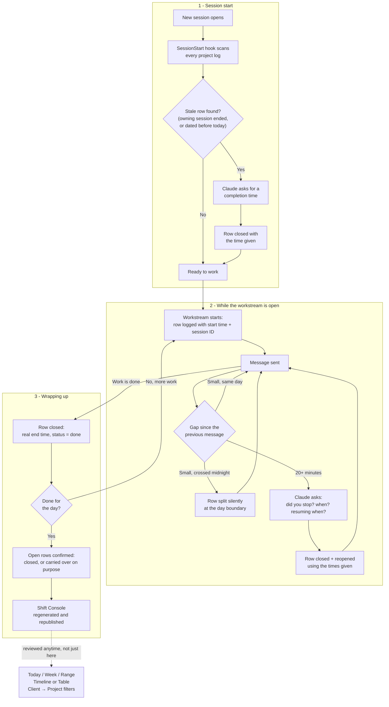
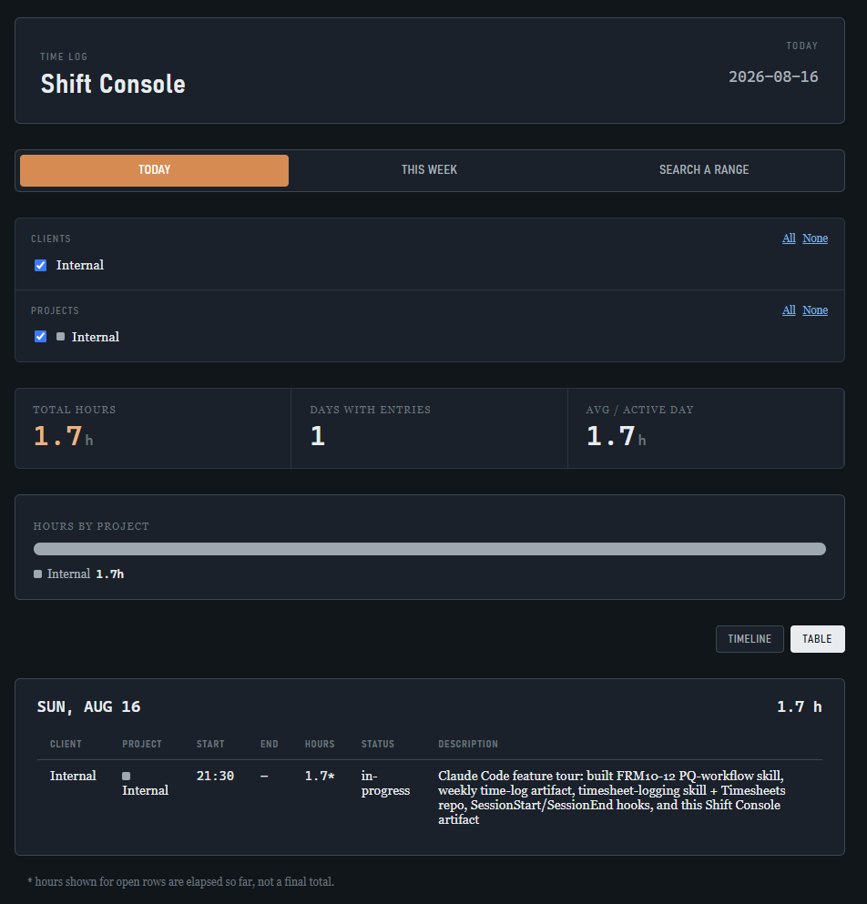
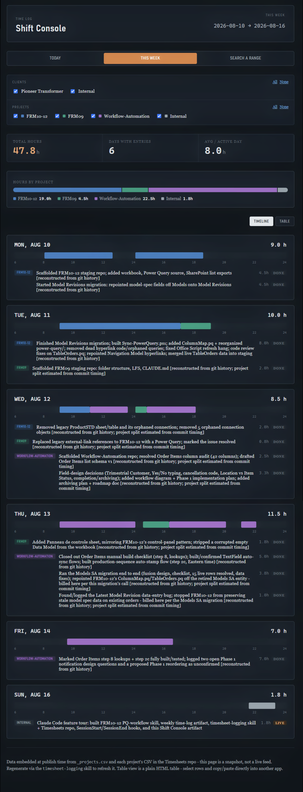
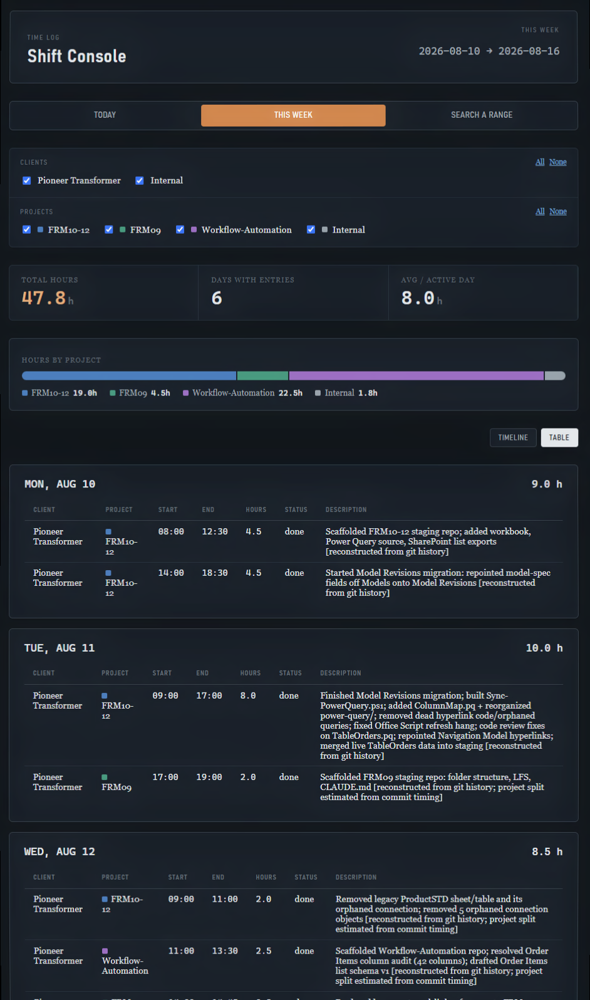

# Shift Console

A time-tracking system for consulting work spanning multiple clients and projects,
built to remove manual timesheet upkeep entirely: hours are captured automatically as
work happens, structured so parallel client work never collides, and surfaced through
an interactive reporting console designed to feed directly into an external timesheet
tool.

## Why it exists

Consulting work here runs across several independent client projects, sometimes
concurrently — a long-running task on one project while attention shifts to another,
or genuinely separate clients' work interleaved within the same day. Reconstructing
accurate hours after the fact from memory or commit history is slow and error-prone.
Shift Console instead treats time-logging as a first-class, automatic part of the
workflow, and gives that data a purpose-built interface for review and export.

## Features

**Automatic, structured logging**
Every distinct unit of work is logged with real start/end timestamps as it happens —
no manual timer, no end-of-day reconstruction. A lightweight session-boundary hook
also stamps session open/close times automatically, as a safety net for anything
missed mid-session.

**Collision-free parallel tracking**
Each project keeps its own independent log. Two clients' work — or two workstreams
within the same client — can be open at the same time without one overwriting the
other, a deliberate design choice to support working across multiple engagements
concurrently.

**A live project registry**
Clients and projects aren't hardcoded anywhere. A single registry file defines what
projects exist, which client they belong to, whether they're billable, and their
display color — adding a new client or project is a one-line change that the entire
system picks up automatically.

**An interactive reporting console**
Rather than a static report, hours are reviewed through a small interactive
application:
- **Today / This Week / Custom range** views, switchable instantly.
- **Client → Project drill-down filters** — pick which clients to look at, then
  narrow to specific projects within them — scoped automatically to whatever
  actually has entries in the selected date range, so the filter list never grows
  unwieldy as more clients and projects accumulate over time.
- **Timeline view** — a visual shift log per day, with real proportional start/end
  bars, a distinct look for work still in progress, and automatic flagging of any
  entry left open past its own day.
- **Table view** — the same data as a clean, plain data table (date, client,
  project, times, hours, status, description), built specifically to be selected
  and pasted straight into an external timesheet system.
- **At-a-glance summary metrics** — total hours, active days, and an hours-by-project
  breakdown for whatever is currently in view.
- Full light/dark theme support, and a colorblind-safe, validated color palette
  identifying each client project consistently throughout.

**Durable, auditable history**
All data lives in version-controlled, plain-text files — nothing proprietary, nothing
that requires this tool specifically to read. Every change has full git history.

## How logging and validation work

Shift Console isn't just a place hours get displayed — it's an active system that
watches for the moments hours could otherwise get lost, and closes them
automatically or with a single, precise confirmation.

**Logging as work happens.** Every distinct unit of work becomes a row the moment it
starts: a project, a real timestamp, a plain-language description — no timer to
remember to start, no reconstructing from memory at the end of the day. The row
stays open for as long as the work is in progress and closes the moment it's
finished, with real elapsed time, never an estimate.

**A three-layer safety net.** Because "just log it as you go" still depends on
nobody forgetting, three independent checks run quietly underneath every session:

1. **Session-start scan** — the instant a new session opens, every project's log is
   checked for work genuinely left behind: a session that ended without closing its
   row, or one that crashed outright. Anything found is surfaced immediately, before
   anything else, with a request for a real completion time.
2. **Idle-gap detection** — every message is measured against the last one. A gap of
   twenty minutes or more triggers a direct question: did work actually stop, and if
   so, when did it stop and when did it resume? The answer — never a guess — becomes
   the row's real closing and reopening time.
3. **Midnight-crossing** — a short gap that happens to cross into a new calendar day
   (working straight through midnight, for instance) needs no interruption at all:
   the entry is split cleanly at the boundary and carries on into the new day as
   what it actually was — one continuous stretch of work.

**Session-aware, not just date-aware.** The harder problem this system solves isn't
detecting a gap — it's not mistaking someone else's *live* work for something
abandoned. Parallel engagements are the normal case here, not the exception: one
console can be actively tracking one client's project while a second is open for
another. A check based on dates alone would see the first console's still-open row
the moment the second one starts and flag it as forgotten - simply wrong. Shift
Console avoids that by tagging every row with the session that opened it, and only
ever treating a row as stale once its *owning* session has actually confirmed it
ended - never merely because another session exists. Two engagements can run side by
side all day without either ever second-guessing the other.

**The result:** hours are never manually reconstructed, never double-counted across
parallel work, and never silently lost to a closed laptop lid - the system either
closes the gap on its own or asks exactly once, with exactly the information needed
to get it right.

### The flow



### File layout

```
_projects.csv              registry: every client + project, billing status, color
<project>.csv              one append-only log per project (id, date, start, end,
                            status, session_id, description)
_internal.csv               non-billable/internal work, tracked the same way
_session-log.md              session-boundary record - also what the stale-row
                              check uses to confirm a session has actually ended
```

The Shift Console itself is a self-contained interactive page: all data is compiled
into it at publish time, so it opens instantly with no backend or live connection,
and is refreshed on request or automatically at the end of a work day.

## Screenshots

**Today view** — opens by default to the current day only; filters automatically
narrow to just the clients/projects with entries in view.



**This Week view, Timeline mode** — client → project drill-down filters, an
hours-by-project summary, and a per-day breakdown with proportional time bars.



**This Week view, Table mode** — the same range, displayed as per-day data tables
built for selecting and pasting rows straight into another timesheet system.



## Status

Actively used for day-to-day time tracking. Current scope: one client (Pioneer
Transformer, three projects) plus internal/tooling work; the registry-driven design
means additional clients and projects require no structural changes to add.
